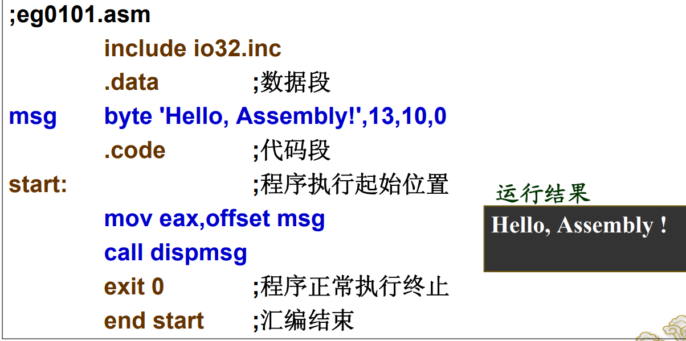

# MASH常量表达：常数

十、十六和二进制形式表达的数值——以后缀字母（D、H和B）区分，十进制数可以不加

**以字母A～F开头的十六进制常数，要加前导0**

| byte(字节）  | 8位  |
| ------------ | ---- |
| word(字）    | 16位 |
| dword(双字） | 32位 |


```assembly
bvar4 byte 5 dup ('$')
     重复次数 DUP (重复参数)
```

